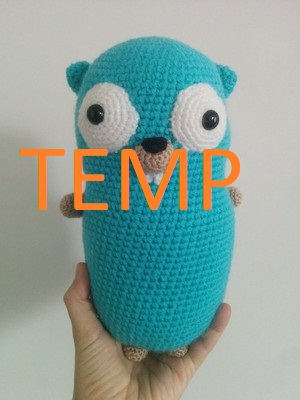
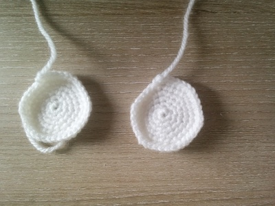
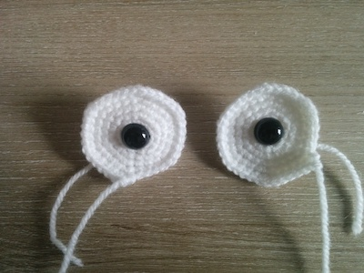
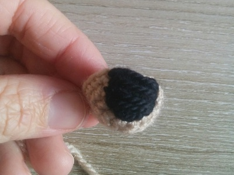
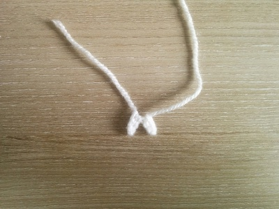
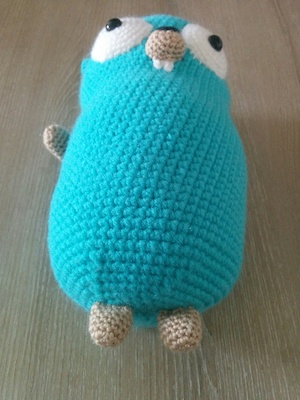
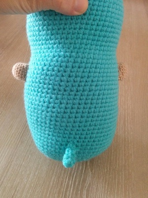

# [WIP Design]
# An Alternate Go Gopher Amigurumi Pattern



## You will need:
* **Yarn:** Turquoise *(aran)*, white, brown, black *(DK)*
* **Crochet hooks:** 2,5 for body and ears; 2 or 2,25 for other details
* One pair of safety eyes 12 mm
* Stuffing (Polyfil)
* Needle
* Stitch marker
* Scissors

## Abbreviations:
```
sc = single crochet stitch
ch = chain
inc = increase (make two stitches into the same stitch)
dec = decrease (I recommend using an invisible decrease)
fo = finish off
```

## Eyeball



```
make two, use white

1. 6 in a magic circle				(6)
2. (inc)x6					(12)
3. (sc, inc)x6					(18)
4. (2 sc, inc)x6				(24)
5. (3 sc, inc)x6				(30)
6. (4 sc, inc)x6				(36)
fo, leave a long thread

Put the safety eyes to the middle of the eyeballs.
```


## Body


```
use aran yarn - Color A

1. 6 in a magic circle				(6)
2. (inc)x6					(12)
3. (sc, inc)x6					(18)
4. (2 sc, inc)x6				(24)
5. (3 sc, inc)x6				(30)
6. (4 sc, inc)x6				(36)
7. (5 sc, inc)x6				(42)
8. (6 sc, inc)x6				(48)
9. (7 sc, inc)x6				(54)
10. (8 sc, inc)x6				(60)
11-25. 60 sc				(60)
26. 14 sc, dec, 28 sc, dec, 14 sc		(58)
27. 14 sc, dec, 27 sc, dec, 13 sc		(56)
28. 14 sc, dec, 26 sc, dec, 12 sc		(54)
29. 14 sc, dec, 25 sc, dec, 11 sc		(52)
30. 52 sc				(52)
31. 12 sc, inc, 26 sc, inc, 12 sc		(54)
32. 13 sc, inc, 26 sc, inc, 13 sc		(56)
33. 14 sc, inc, 26 sc, inc, 14 sc		(58)
34. 15 sc, inc, 26 sc, inc, 15 sc		(60)

```

```
Place the eyes leaving 13 rows empty from the top of the head. 
If you wish to make bulging eyes, use a bit of the stuffing for the eyes.
```


With Color A and Color B...

```
35-43. 60 sc A		(60)
35. 60 sc A		(60)
36. 29 sc A, 2 sc B, 29 sc A		(60)
37. 28 sc A, 4 sc B, 28 sc A		(60)
38. 27 sc A, 6 sc B, 27 sc A		(60)
39. 26 sc A, 8 sc B, 26 sc A		(60)
40. 25 sc A, 10 sc B, 25 sc A		(60)
41. 24 sc A, 12 sc B, 24 sc A		(60)
42. 23 sc A, 14 sc B, 23 sc A		(60)
43. 22 sc A, 16 sc B, 22 sc A		(60)
44. 21 sc A, 18 sc B, 21 sc A		(60)
45. 20 sc A, 20 sc B, 20 sc A		(60)
46. 19 sc A, 22 sc B, 19 sc A		(60)
47. 18 sc A, 24 sc B, 18 sc A		(60)

Start to stuff the body.

48. A: 8 sc, dec, 7 sc || B: 1 sc, dec, (8 sc, dec)x2, 2 sc || A: 6 sc, dec, 8 sc, dec		(54)
49. A: 7 sc, dec, 7 sc || B: dec, (7 sc, dec)x2, 2 sc || A: 5 sc, dec, 7 sc, dec		(48)
50. A: (6 sc, dec)x2 || B: (6 sc, dec)x2, 2 sc || A: 4 sc, dec, 6 sc, dec		(42)
51. A: (5 sc, dec)x2 || B: (5 sc, dec)x2, 2 sc || A: 3 sc, dec, 5 sc, dec		(36)
52. A: (4 sc, dec)x2 || B: (4 sc, dec)x2, 2 sc || A: 2 sc, dec, 4 sc, dec		(30)
53. A: (3 sc, dec)x2 || B: (3 sc, dec)x2, 2 sc || A: 1 sc, dec, 3 sc, dec		(24)
54. A: (2 sc, dec)x2 || B: (2 sc, dec)x2, 2 sc || A: dec, 2 sc, dec		(18)
55. A: (sc, dec)x2 || B: (2 sc, dec)x3 || A: sc, dec		(12)
56. A: 2 dec || B: 3 dec || A: dec		(6)

fo, close the body.
```

## Ear
```
make two, use aran

1. 4 in a magic circle				(4)
2. (inc)x4					(8)
3. (sc, inc)x4					(12)
4. 12 sc					(12)
fo, leave a long thread

Sew the ears to the head (leaving around 9 rows from the top of the head).
```

## Mouth


```
use brown

1. 6 in a magic circle				(6)
2. (inc)x6					(12)
3. (sc, inc)x6					(18)
4.-5. 18 sc				(18)
fo, leave a long thread

Embroider the upper part with black yarn.
```

## Teeth


```
use white

Make a chain of 4 sc, start in the second stitch of the chain and go back to the beginning, 
Make another chain of 4 sc, come back the same way. 

Sew the teeth to the proper place, then sew the mouth to the place.
```

## Leg


```
make 4, use brown

1. 6 in a magic circle				(6)
2. (inc)x6					(12)
3.-7. 12 sc				(12)
fo, leave a long thread

Sew the legs to the body.
```

## Tail


```
use aran

1. 4 in a magic circle				(4)
2.-4. 4 sc					(4)
fo, leave a long thread

Sew the tail to the body.
```

Well done, your Gopher is ready! :)
