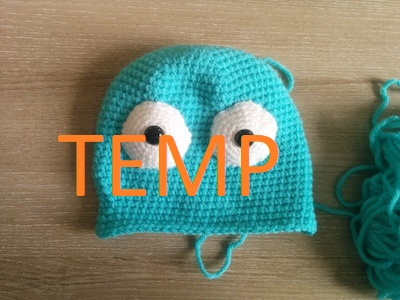

# [WIP Design]
# An Alternate Go Gopher Amigurumi Pattern


## You will need:
* **Yarn:** 
    * Body Color A (Blue) *(aran, ~100g)*
    * Body Color B (Light Blue) *(aran, ~25g)*
    * Eye Color (White) *(DK, ~10g)*
    * Limb Color (Brown) *(DK, ~15g)*
    * Nose Color (Black) *(DK, ~1g)*
* **Crochet hooks:**
	* 2.5mm for body and ears
	* 2.0mm-2.25mm for other details
* Safety eyes (1x 12mm pair)
* Stuffing (polyfil)
* Needle, Scissors, & Stitch Markers

## Abbreviations:
```
sc = single crochet stitch
ch = chain stich
inc = increase (make two stitches into the same stitch)
dec = decrease (I recommend using an [invisible decrease](https://www.allaboutami.com/invisibledecrease/))
fo = finish off
```

## Eyes


Using White, make two of the below:
```
1. 6 sc in a magic circle				(6)
2. 6 inc					(12)
3. (sc, inc)x6					(18)
4. (2 sc, inc)x6				(24)
5. (3 sc, inc)x6				(30)
6. (4 sc, inc)x6				(36)
fo (leave a long thread)
```
Attach the safety eyes to the middle of each eyeball.


## Body


Using Body Color A (aran)...
```
1. 6 sc in a magic circle			 (6)
2. (inc)x6					(12)
3. (sc, inc)x6					(18)
4. (2 sc, inc)x6				(24)
5. (3 sc, inc)x6				(30)
6. (4 sc, inc)x6				(36)
7. (5 sc, inc)x6				(42)
8. (6 sc, inc)x6				(48)
9. (7 sc, inc)x6				(54)
10. (8 sc, inc)x6				(60)
11-25. 60 sc					(60)
26. 14 sc, dec, 28 sc, dec, 14 sc		(58)
27. 14 sc, dec, 27 sc, dec, 13 sc		(56)
28. 14 sc, dec, 26 sc, dec, 12 sc		(54)
29. 14 sc, dec, 25 sc, dec, 11 sc		(52)
30. 52 sc					(52)
31. 12 sc, inc, 26 sc, inc, 12 sc		(54)
32. 13 sc, inc, 26 sc, inc, 13 sc		(56)
33. 14 sc, inc, 26 sc, inc, 14 sc		(58)
34. 15 sc, inc, 26 sc, inc, 15 sc		(60)

```

Place and attach the eyes so that the very top of each falls ~row 13. 
I recommend stuffing the eyes a bit (to create an overstuffed/bulging look).



Using Body Color A and Body Color B, continue the body as follows...

```
35. [A] 60 sc					(60)
36. [A] 29 sc || [B]  2 sc || [A] 29 sc		(60)
37. [A] 28 sc || [B]  4 sc || [A] 28 sc		(60)
38. [A] 27 sc || [B]  6 sc || [A] 27 sc		(60)
39. [A] 26 sc || [B]  8 sc || [A] 26 sc		(60)
40. [A] 25 sc || [B] 10 sc || [A] 25 sc		(60)
41. [A] 24 sc || [B] 12 sc || [A] 24 sc		(60)
42. [A] 23 sc || [B] 14 sc || [A] 23 sc		(60)
43. [A] 22 sc || [B] 16 sc || [A] 22 sc		(60)
44. [A] 21 sc || [B] 18 sc || [A] 21 sc		(60)
45. [A] 20 sc || [B] 20 sc || [A] 20 sc		(60)
46. [A] 19 sc || [B] 22 sc || [A] 19 sc		(60)
47. [A] 18 sc || [B] 24 sc || [A] 18 sc		(60)
```

Start to stuff the body (fill ~80% of current progress), then continue as below...

```
48. [A]  8 sc, dec, 7 sc || [B] 1 sc, dec, (8 sc, dec)x2, 2 sc || [A] 6 sc, dec, 8 sc, dec		(54)
49. [A]  7 sc, dec, 7 sc || [B]       dec, (7 sc, dec)x2, 2 sc || [A] 5 sc, dec, 7 sc, dec		(48)
50. [A] (6 sc, dec)x2    || [B]            (6 sc, dec)x2, 2 sc || [A] 4 sc, dec, 6 sc, dec		(42)
51. [A] (5 sc, dec)x2    || [B]            (5 sc, dec)x2, 2 sc || [A] 3 sc, dec, 5 sc, dec		(36)
52. [A] (4 sc, dec)x2    || [B]            (4 sc, dec)x2, 2 sc || [A] 2 sc, dec, 4 sc, dec		(30)
53. [A] (3 sc, dec)x2    || [B]            (3 sc, dec)x2, 2 sc || [A] 1 sc, dec, 3 sc, dec		(24)
54. [A] (2 sc, dec)x2    || [B]            (2 sc, dec)x2, 2 sc || [A]       dec, 2 sc, dec		(18)
55. [A]   (sc, dec)x2    || [B]            (2 sc, dec)x3       || [A]              sc, dec		(12)
56. [A]      2 dec       || [B]                 3 dec          || [A]                  dec		 (6)

fo (closing the body)
```

## Ears
Using Body Color A, make two of the below:
```
1. 4 sc in a magic circle			 (4)
2. 4 inc					 (8)
3. (sc, inc)x4					(12)
4. 12 sc					(12)
fo (leave a long thread)
```
Sew the ears to the head (creating ~9 rows between the ears and the top of the head).

## Mouth


Using Brown, make one of the below:
```
1. 6 sc in a magic circle			 (6)
2. 6 inc					(12)
3. (sc, inc)x6					(18)
4. 18 sc					(18)
5. 18 sc					(18)
fo (leave a long thread)
```
Embroider the upper part of the nose with Black.

## Teeth


Using White...
```
1. Make a chain of 4 sc, start in the second stitch of the chain and go back to the beginning, 
2. Make another chain of 4 sc, come back the same way. 
```
Sew the teeth to the proper place on the mouth, then sew the mouth to the body.

## Legs


Using Brown, make four of the below:
```
1. 6 sc in a magic circle		 (6)
2. 6 inc				(12)
3. 12 sc				(12)
4. 12 sc				(12)
5. 12 sc				(12)
6. 12 sc				(12)
7. 12 sc				(12)
fo (leave a long thread)
```
Sew the legs to the body.

## Tail


Using Body Color A...
```
1. 4 sc in a magic circle		(4)
2. 4 sc					(4)
3. 4 sc					(4)
4. 4 sc					(4)

fo (leave a long thread)

```
Sew the tail to the body.


**Well done; your Gopher is ready!** Hope you enjoy <3
